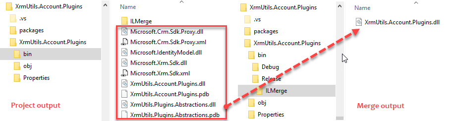

Configurable ILMerge Task for MSBuild
=====================================

Adds ILMerge to Visual Studio 2013/2017 or automated builds. This Task is intended to work right out of the box however, it supports a configuration file where you can control every ILMerge property including the list of assemblies to be merged.

Getting Started
---------------

Use Nuget to add ILMerge.MSBuild.Task to your Visual Studio project:

```
Install-Package ILMerge.MSBuild.Task
```

Build your project. The merged assembly will be stored in an ILMerge folder under your project output.
The output directory is configurable.

<br />



Easy to Use and Configure
--------------------------

By default all references with *Copy Local* equals *true* are merged to the project output, giving you an "ILMerged" assembly right out of the box.
You can change this behavior and a lot more through an optional configuration file.
For example, a static list of assemblies can be used instead of the dynamic dependency on the *Copy Local* property.

```javascript
{
	"General": {
		"InputAssemblies": [
		  "XrmUtils.Plugins.Abstractions", 
		  "XrmUtils.Plugins.Utilities" 
		]
	}
}
```

Project Wiki
------------

See the [Project Wiki](https://github.com/emerbrito/ILMerge-MSBuild-Task/wiki) for more details.
