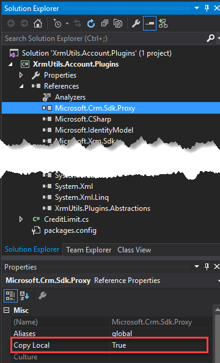

Configurable ILMerge Task for MSBuild
=====================================

Adds ILMerge to Visual Studio 2013/2015 or automated builds. This Task is intended to work right out of the box however, it supports a configuration file where you can control every ILMerge property including the list of assemblies to be merged.

Installing
----------

Use Nuget to add ILMerge.MSBuild.Task to your Visual Studio project:

```
Install-Package ILMerge.MSBuild.Task
```

Build your project. A new ILMerge folder containing the merged assembly will be created in your target folder.

Default Behavior
----------------

By default all references with *Copy Local* equals *true* are merged with the project output.



The actual output stays untouched and a new (merged) assemly is created under the ILMerge folder.
The output directory can be changed through configuration.


Refining What Gets Merged
-------------------------

The default behavior even though handy may not work for everyone.
You may decide that you don't want to maintain the *Copy Local* attribute which may change after you remove and re-install packages.
Instead you want to create a static list of assemblies to merge so you can guarantee the same result on every build. This can be done through a configuration file.

### Using a Configuration File

On the root of your project create a file called:

```
ILMergeConfig.json
```

This snippet will instruct the Task to ignore the *Copy Local* property and use the files from this list instead.
See Configuration File section for a complete reference.

```javascript
{
	"General": {
		"InputAssemblies": [
		  "$(TargetDir)XrmUtils.Plugins.Abstractions", 
		  "$(TargetDir)XrmUtils.Plugins.Utilities" 
		]
	}
}
```

Note the use of a variable which will be replaced at runtime with the target folder.
See the project wiki for a list of available variables.

Configuration File
------------------

See the project wiki for more details on the cofiguration file.
